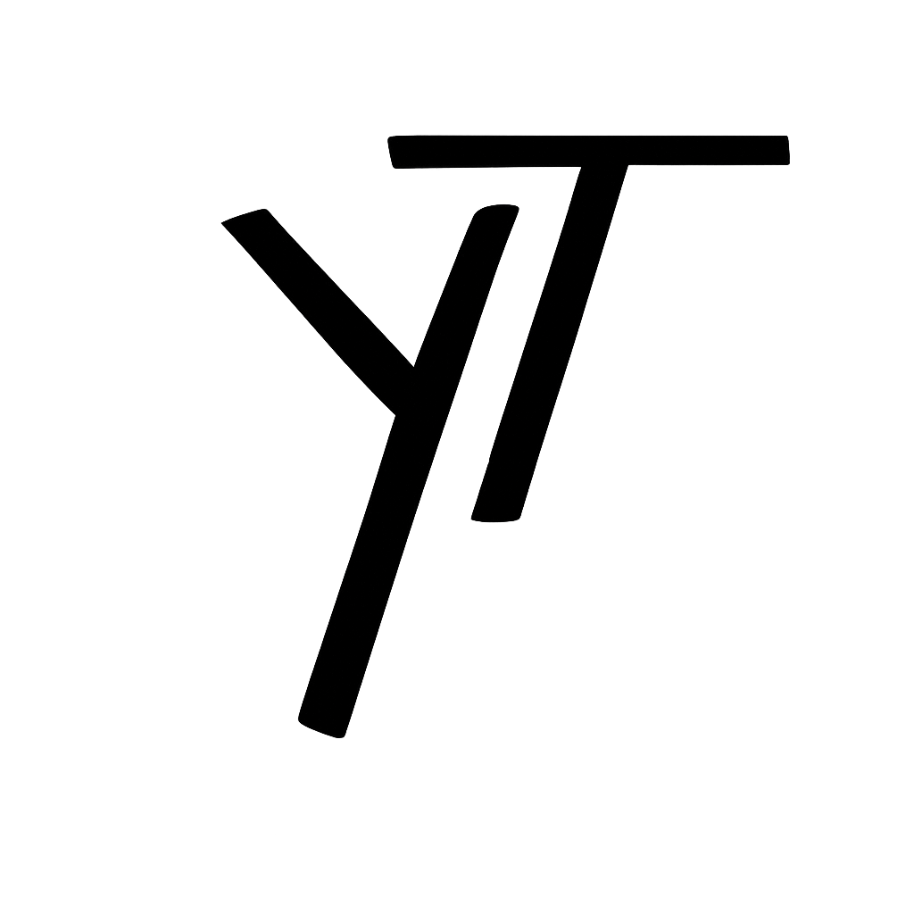

```{=html}
<div class="about-title-row">
  
  <div class="about-title-text">
    <h1>Yulia Tyukhova, PhD, LC</h1>
    <p class="about-subtitle">Independent Researcher</p>
  </div>
</div>
```

<div style="text-align: left;">

<div class="about-columns">
<div class="about-column about-column-photo">
<div class="about-photo-wrap">
  
</div>
</div>
<div class="about-column about-column-text">

Yulia Tyukhova, PhD, is an independent researcher specializing in lighting quality, human perception, and visual comfort. Previously she was a Senior Illumination Research Engineer at Acuity. She is experienced in leading and conducting complex research projects with human subjects, including designing, setting up, measuring, and executing controlled experiments in the field of lighting. She has advanced expertise in lighting measurements, calculations, and software. She received her PhD in Architectural Engineering - Lighting from the University of Nebraska-Lincoln.

Dr. Tyukhova authors and reviews scientific publications, holds two patents, and presents her work at professional venues such as the Illuminating Engineering Society (IES) Annual Conference, the U.S. Department of Energy Lighting R&D Workshop, and the IES Webinar series. She actively contributes to the advancement of the profession through service on technical and non-technical committees of the IES, including having chaired three of them, as well as committees of the International Commission on Illumination (CIE) and the Transportation Research Board (TRB).

Yulia Tyukhova is a recipient of the Fulbright Scholarship, the Richard Kelly Grant, and the STEP Ahead Emerging Leader Award. She was also recognized by Lighting Design + Application (LD+A) magazine as a future thought leader in the lighting industry.

[Request a copy of the CV.](mailto:yulia@hai-lights.co)

<div class="about-icon-links about-icon-links-boxed">
  <a class="about-icon-card" href="https://www.linkedin.com/in/yuliatyukhova/" target="_blank" aria-label="LinkedIn">
    <i class="bi bi-linkedin"></i><span>LinkedIn</span>
  </a>
  <a class="about-icon-card" href="https://x.com/ytyukhova/" target="_blank" aria-label="X">
    <i class="bi bi-twitter"></i><span>X</span>
  </a>
  <a class="about-icon-card" href="https://www.researchgate.net/profile/Yulia_Tyukhova?ev=hdr_xprf" target="_blank" aria-label="ResearchGate">
    <span>ResearchGate</span>
  </a>
  <a class="about-icon-card" href="https://scholar.google.com/citations?user=Ev9KmxoAAAAJ&hl=en" target="_blank" aria-label="Google Scholar">
    <i class="bi bi-mortarboard"></i><span>Google Scholar</span>
  </a>
</div>
</div>
</div>

## Professional and Research Interests {#research-interests}

* **Lighting**
* **Technology**
* **Human perception**
* **Data analytics**

## Education {#education}

**University of Nebraska-Lincoln** | Ph.D., Architectural Engineering - Lighting

## Awards & Honors {#awards-and-honors}

* **Fulbright Scholarship**
* **Richard Kelly Grant**
* **STEP (Science, Technology, Engineering and Production) Ahead Emerging Leader Award**

## Reviewer for Scientific Journals {#reviewer-for-scientific-journals}

* **Leukos**
* **Lighting Research & Technology**
* **Energy and Buildings**

</div>
