```{=html}
<div class="nb-home">
  <section class="nb-hero">
    <div class="nb-hero-copy">
      <div class="nb-kicker">Researcher and Technical Lead</div>
      <h1>Yulia Tyukhova</h1>
      <p class="nb-hero-subtitle">
        Join me in exploring new technologies, tools, and insights shaping the lighting industry and beyond.
      </p>
      <div class="nb-hero-actions">
        <a class="nb-button ghost" href="posts/">Read Hai-lights</a>
        <a class="nb-button ghost" href="contact.qmd">Get in touch</a>
      </div>
    </div>
    <div class="nb-hero-media">
      
    </div>
  </section>

  <section class="nb-features">
    <div class="nb-feature">
      <h2>Excellence</h2>
      <p>Lighting quality and visual comfort research and exploration of AI tools and technologies.</p>
    </div>
    <div class="nb-feature">
      <h2>Impact</h2>
      <p>Leadership, technical reports, and applied guidance that translate research into practice and policy.</p>
    </div>
    <div class="nb-feature">
      <h2>Results</h2>
      <p>Measurements, data-driven results, and interpretable outcomes for decision makers.</p>
    </div>
  </section>

  <section class="nb-quote-callout" aria-labelledby="nb-quote-title">
    <p class="nb-quote-kicker" id="nb-quote-title">From Hai-lights</p>
    <blockquote class="nb-home-quote">
      Not using AI systems for various tasks increasingly feels like falling behind in productivity and efficiency, yet using them raises fundamental questions: can we trust the results, how do we verify their accuracy, and what is our role as AI systems autonomously complete tasks of increasing complexity?
    </blockquote>
    <a class="nb-quote-link" href="posts/2026_04_20_welcome/">Read more</a>
  </section>

  <section class="nb-publications" aria-label="Selected publications">
    <div class="nb-publication-slider" id="featured-publication-slider" tabindex="0" aria-label="Featured publications">
      <a class="nb-publication-card" href="https://journals.sagepub.com/doi/10.1177/03606325261420953?icid=int.sj-full-text.similar-articles.3" target="_blank" rel="noreferrer">
        <div class="nb-publication-page">
          <div class="nb-publication-preview">
            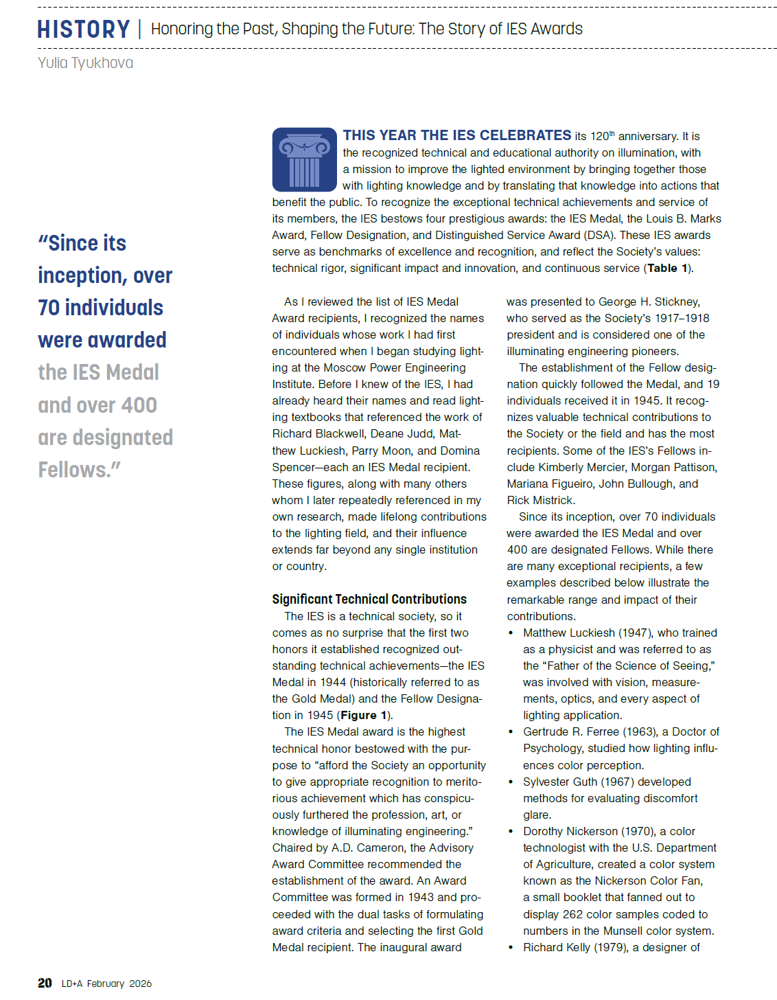
          </div>
        </div>
      </a>

      <a class="nb-publication-card" href="https://ies.org/fires/discomfort-glare-models-in-outdoor-environments-after-dark/" target="_blank" rel="noreferrer">
        <div class="nb-publication-page">
          <div class="nb-publication-preview">
            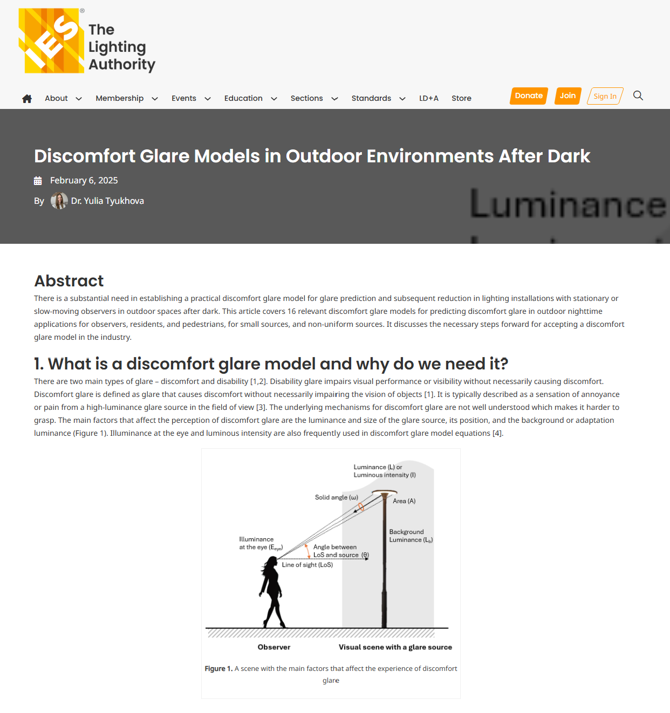
          </div>
        </div>
      </a>

      <a class="nb-publication-card" href="https://www.sciencedirect.com/science/article/abs/pii/S0360132324006929?via%3Dihub" target="_blank" rel="noreferrer">
        <div class="nb-publication-page">
          <div class="nb-publication-preview">
            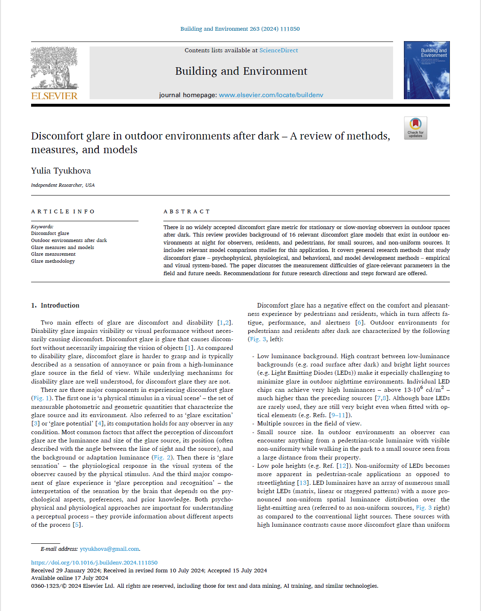
          </div>
        </div>
      </a>

      <a class="nb-publication-card" href="https://journals.sagepub.com/doi/10.1177/036063252005000416?icid=int.sj-abstract.similar-articles.9" target="_blank" rel="noreferrer">
        <div class="nb-publication-page">
          <div class="nb-publication-preview">
            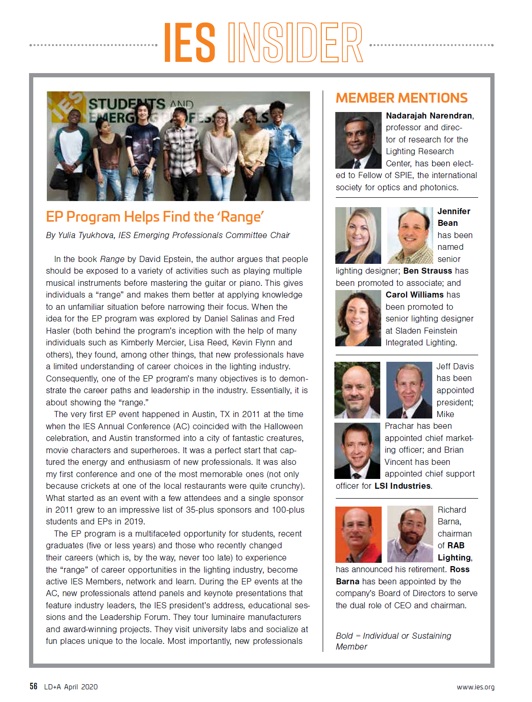
          </div>
        </div>
      </a>

      <a class="nb-publication-card" href="https://patents.google.com/patent/US10309588B2/en" target="_blank" rel="noreferrer">
        <div class="nb-publication-page">
          <div class="nb-publication-preview">
            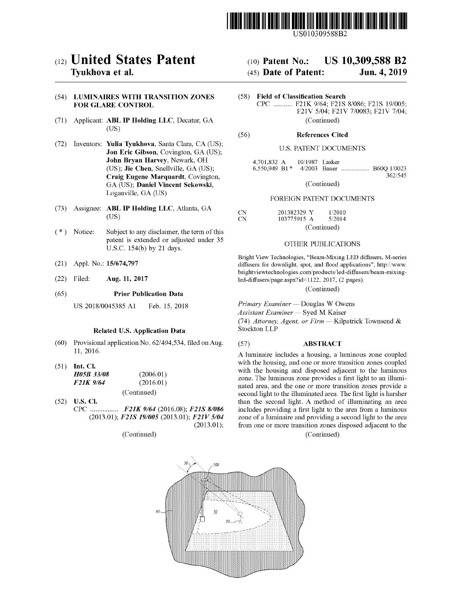
          </div>
        </div>
      </a>

      <a class="nb-publication-card" href="https://store.ies.org/product/rp-39-19-recommended-practice-off-roadway-sign-luminance/?v=0b3b97fa6688" target="_blank" rel="noreferrer">
        <div class="nb-publication-page">
          <div class="nb-publication-preview">
            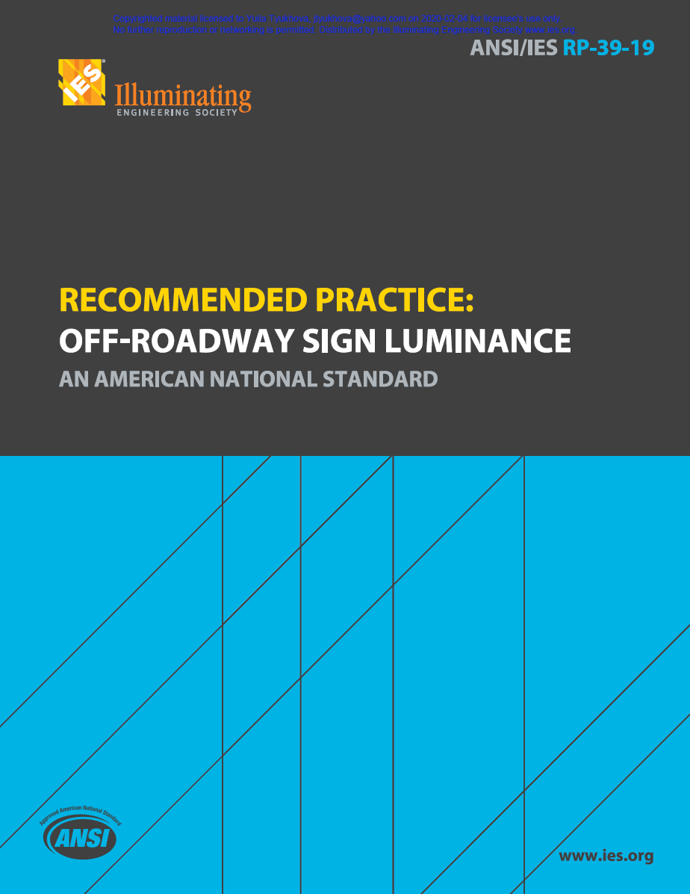
          </div>
        </div>
      </a>

      <a class="nb-publication-card" href="https://cie.co.at/publications/discomfort-caused-glare-luminaires-non-uniform-source-luminance" target="_blank" rel="noreferrer">
        <div class="nb-publication-page">
          <div class="nb-publication-preview">
            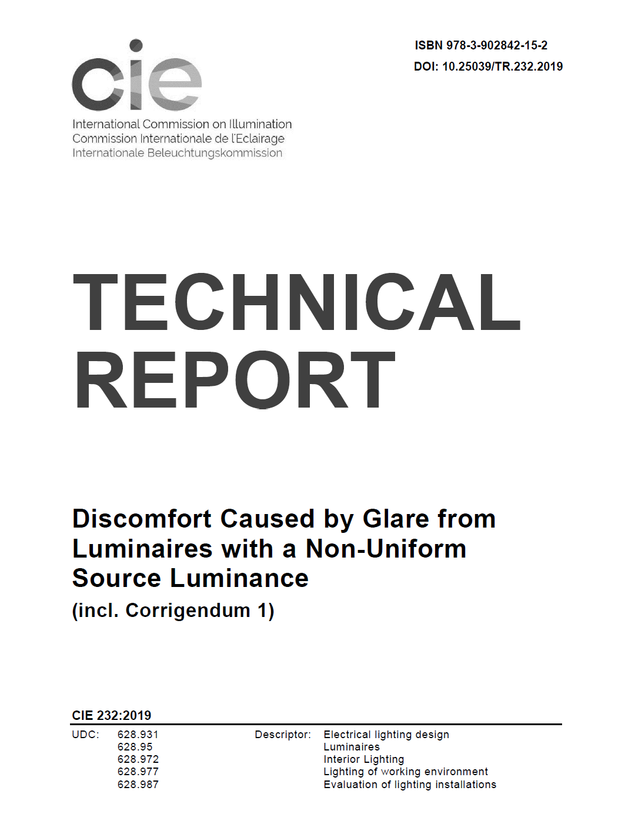
          </div>
        </div>
      </a>

      <a class="nb-publication-card" href="https://www.tandfonline.com/doi/full/10.1080/15502724.2018.1434415" target="_blank" rel="noreferrer">
        <div class="nb-publication-page">
          <div class="nb-publication-preview">
            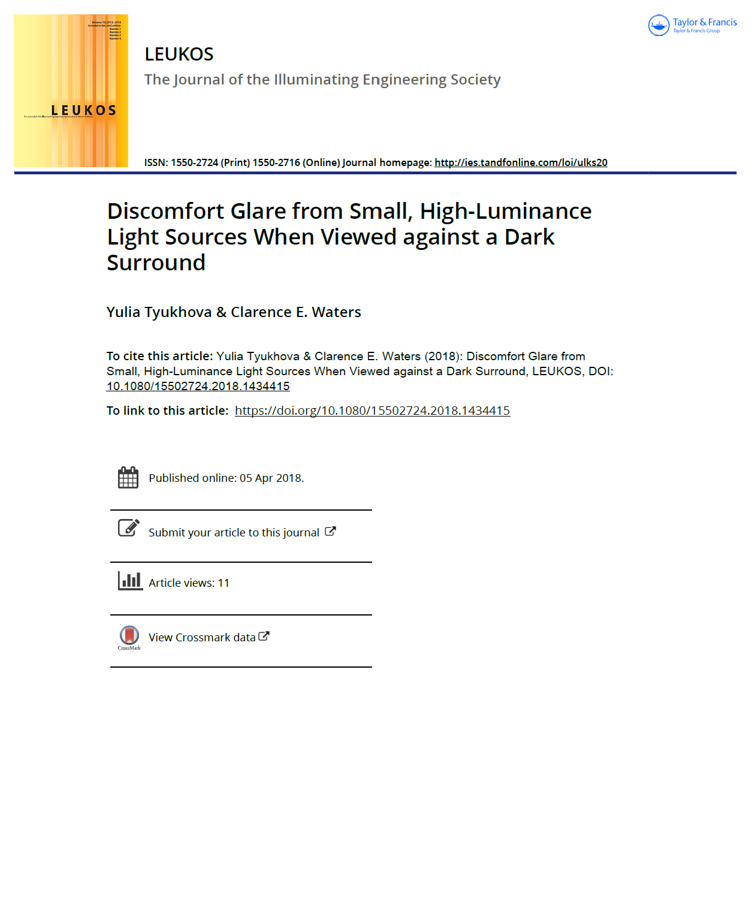
          </div>
        </div>
      </a>

      <a class="nb-publication-card" href="https://journals.sagepub.com/doi/10.1177/1477153518772000" target="_blank" rel="noreferrer">
        <div class="nb-publication-page">
          <div class="nb-publication-preview">
            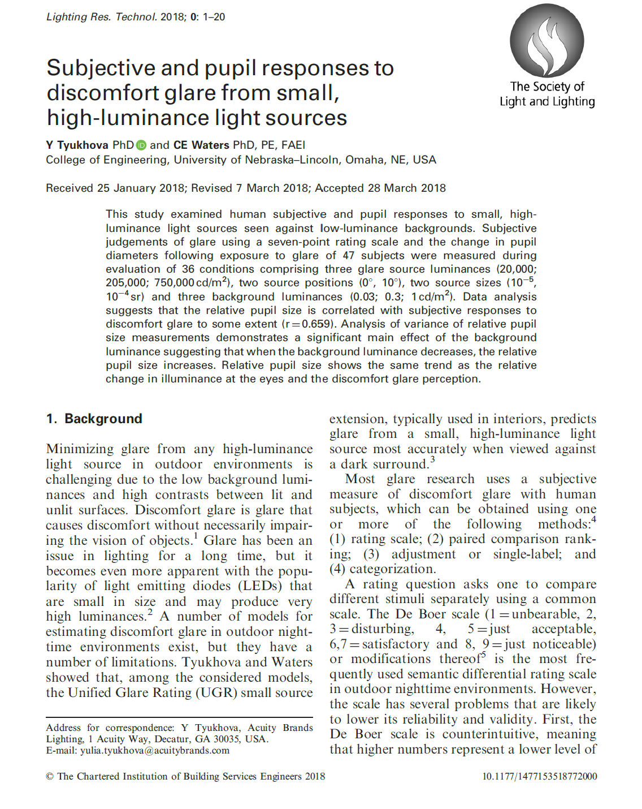
          </div>
        </div>
      </a>

      <a class="nb-publication-card" href="https://www.ies.org/lda/leadership-without-formal-authority/" target="_blank" rel="noreferrer">
        <div class="nb-publication-page">
          <div class="nb-publication-preview">
            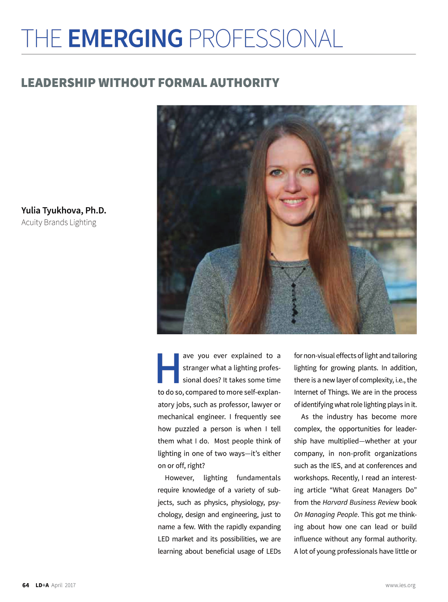
          </div>
        </div>
      </a>

      <a class="nb-publication-card" href="https://digitalcommons.unl.edu/dissertations/AAI3738962/" target="_blank" rel="noreferrer">
        <div class="nb-publication-page">
          <div class="nb-publication-preview">
            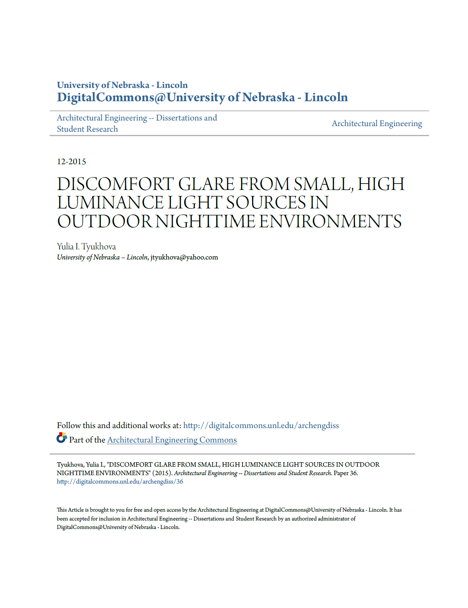
          </div>
        </div>
      </a>

      <a class="nb-publication-card" href="https://www.tandfonline.com/doi/abs/10.1080/15502724.2014.861279" target="_blank" rel="noreferrer">
        <div class="nb-publication-page">
          <div class="nb-publication-preview">
            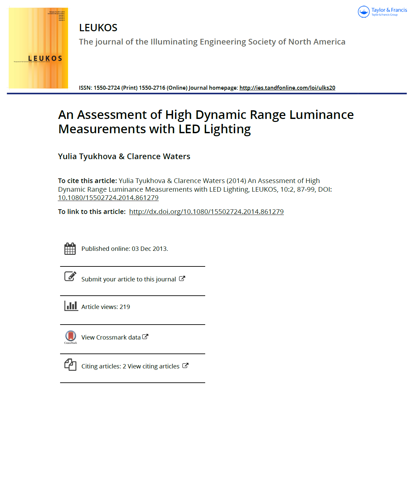
          </div>
        </div>
      </a>

      <a class="nb-publication-card" href="https://digitalcommons.unl.edu/archengdiss/17/" target="_blank" rel="noreferrer">
        <div class="nb-publication-page">
          <div class="nb-publication-preview">
            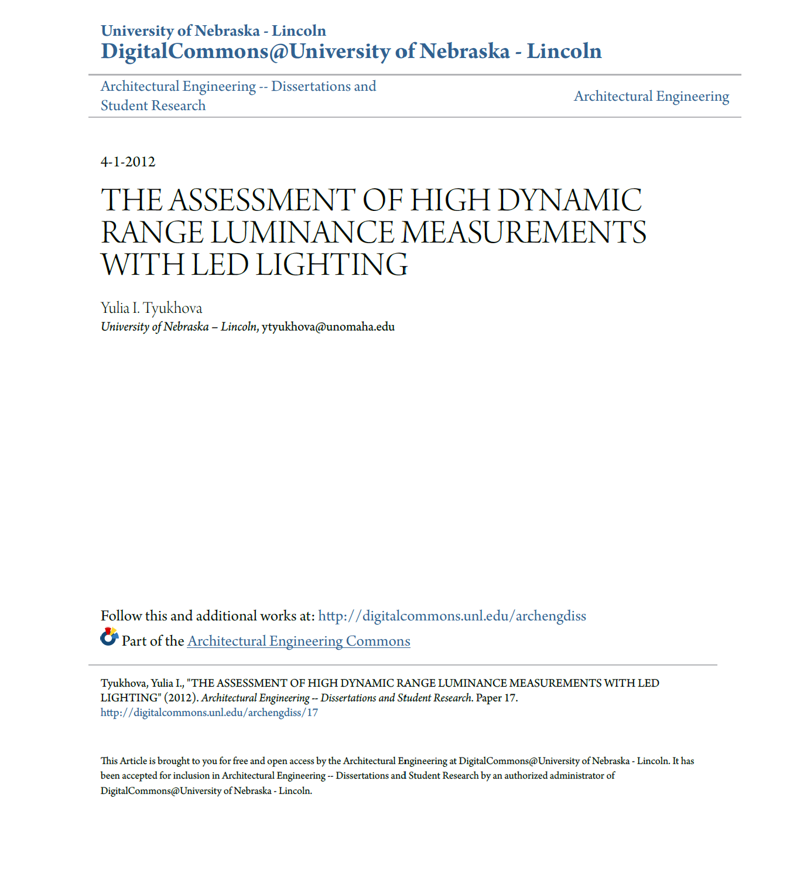
          </div>
        </div>
      </a>
    </div>

    <div class="nb-slider-controls nb-slider-controls-bottom" aria-label="Publication slider controls">
      <button class="nb-slider-button" type="button" data-slider-target="featured-publication-slider" data-direction="-1" aria-label="Scroll publications left">←</button>
      <button class="nb-slider-button" type="button" data-slider-target="featured-publication-slider" data-direction="1" aria-label="Scroll publications right">→</button>
    </div>

  </section>

  <section class="nb-interests" aria-labelledby="research-interests-title">
    <h2 id="research-interests-title">Research Interests</h2>
    <div class="nb-interest-grid">
      <div class="nb-interest-tile">Lighting</div>
      <div class="nb-interest-tile">Technology</div>
      <div class="nb-interest-tile">Human perception</div>
      <div class="nb-interest-tile">Data analytics</div>
    </div>
  </section>

  <section class="nb-webinars" aria-label="Featured webinars">
    <h2>Webinars</h2>
    <div class="nb-webinar-grid">
      <a class="nb-webinar-tile" href="https://elearning.ies.org/products/discomfort-glare-in-outdoor-nighttime-environments#tab-product_tab_overview" target="_blank" rel="noreferrer">
        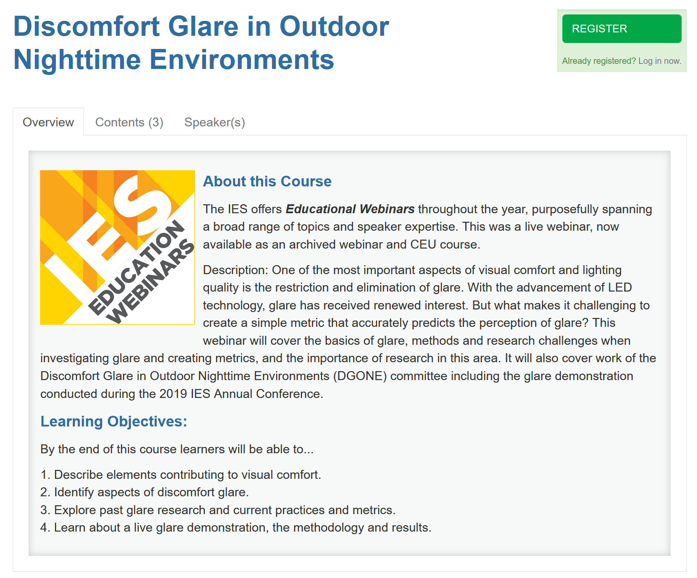
      </a>
      <a class="nb-webinar-tile" href="https://elearning.ies.org/products/glare-affairs-navigating-nighttime-discomfort-with-diverse-models" target="_blank" rel="noreferrer">
        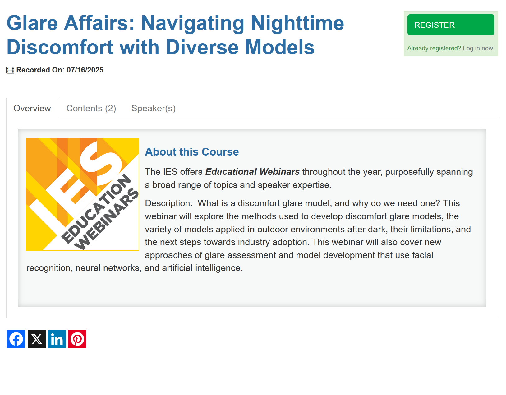
      </a>
    </div>
  </section>
</div>

<style>
  .nb-publication-slider {
    grid-auto-columns: minmax(10rem, 24%) !important;
  }

  .nb-publication-page {
    aspect-ratio: 4 / 5 !important;
    padding: 0.35rem !important;
  }

  .nb-publication-preview {
    height: 100% !important;
  }

  @media (max-width: 900px) {
    .nb-publication-slider {
      grid-auto-columns: minmax(10rem, 42%) !important;
    }
  }

  @media (max-width: 600px) {
    .nb-publication-slider {
      grid-auto-columns: minmax(9rem, 64%) !important;
    }
  }
</style>

<script>
  document.addEventListener("DOMContentLoaded", () => {
    const slider = document.getElementById("featured-publication-slider");
    const buttons = Array.from(document.querySelectorAll(".nb-slider-button"));

    if (!slider || buttons.length === 0) {
      return;
    }

    const originals = Array.from(slider.querySelectorAll(".nb-publication-card"));

    if (originals.length === 0) {
      return;
    }

    const makeClone = (card) => {
      const clone = card.cloneNode(true);
      clone.classList.add("is-clone");
      clone.setAttribute("aria-hidden", "true");
      clone.setAttribute("tabindex", "-1");
      clone.querySelectorAll("a, button").forEach((element) => {
        element.setAttribute("tabindex", "-1");
      });
      return clone;
    };

    originals.slice().reverse().forEach((card) => {
      slider.prepend(makeClone(card));
    });

    originals.forEach((card) => {
      slider.append(makeClone(card));
    });

    const getGap = () => {
      const sliderStyles = window.getComputedStyle(slider);
      return Number.parseFloat(sliderStyles.columnGap || sliderStyles.gap || "0");
    };

    const getStride = () => {
      const firstCard = slider.querySelector(".nb-publication-card");
      const cardWidth = firstCard ? firstCard.getBoundingClientRect().width : slider.clientWidth;
      return cardWidth + getGap();
    };

    const getLoopWidth = () => getStride() * originals.length;

    let isPaused = false;
    let animationFrameId = null;
    let lastTimestamp = 0;
    let resumeTimeoutId = null;

    const normalizeScroll = () => {
      const loopWidth = getLoopWidth();

      if (loopWidth <= 0) {
        return;
      }

      if (slider.scrollLeft < loopWidth * 0.5) {
        slider.scrollLeft += loopWidth;
      } else if (slider.scrollLeft > loopWidth * 1.5) {
        slider.scrollLeft -= loopWidth;
      }
    };

    const pauseLoop = () => {
      isPaused = true;
      lastTimestamp = 0;
    };

    const resumeLoop = () => {
      if (resumeTimeoutId !== null) {
        window.clearTimeout(resumeTimeoutId);
        resumeTimeoutId = null;
      }

      isPaused = false;
    };

    const resumeLoopSoon = () => {
      if (resumeTimeoutId !== null) {
        window.clearTimeout(resumeTimeoutId);
      }

      resumeTimeoutId = window.setTimeout(() => {
        isPaused = false;
        resumeTimeoutId = null;
      }, 900);
    };

    const tick = (timestamp) => {
      if (!isPaused) {
        if (lastTimestamp !== 0) {
          const deltaSeconds = (timestamp - lastTimestamp) / 1000;
          slider.scrollLeft += deltaSeconds * 36;
          normalizeScroll();
        }

        lastTimestamp = timestamp;
      } else {
        lastTimestamp = 0;
      }

      animationFrameId = window.requestAnimationFrame(tick);
    };

    const jumpToMiddle = () => {
      slider.scrollLeft = getLoopWidth();
    };

    jumpToMiddle();

    buttons.forEach((button) => {
      button.addEventListener("click", () => {
        const direction = Number(button.dataset.direction || 1);
        const step = getStride() * 3 * direction;

        pauseLoop();
        slider.scrollBy({
          left: step,
          behavior: "smooth"
        });

        resumeLoopSoon();
      });
    });

    slider.addEventListener("mouseenter", pauseLoop);
    slider.addEventListener("mouseleave", resumeLoop);
    slider.addEventListener("focusin", pauseLoop);
    slider.addEventListener("focusout", resumeLoopSoon);
    slider.addEventListener("touchstart", pauseLoop, { passive: true });
    slider.addEventListener("touchend", resumeLoopSoon, { passive: true });
    slider.addEventListener("scroll", normalizeScroll, { passive: true });

    window.addEventListener("resize", () => {
      jumpToMiddle();
    });

    document.addEventListener("visibilitychange", () => {
      if (document.hidden) {
        pauseLoop();
      } else {
        resumeLoop();
      }
    });

    animationFrameId = window.requestAnimationFrame(tick);
  });
</script>
```
