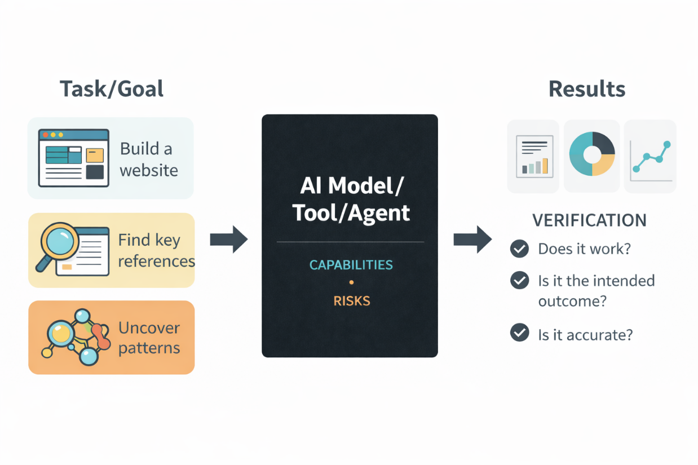

Welcome to the **HAI-LIGHTS** blog - a platform I will use to document my exploration of artificial intelligence (AI) and tool development, and a variety of topics in the lighting industry and research. The pace of AI development is extremely rapid and often overwhelming - ranging from chatbots and coding agents to foundation models with emerging properties and powerful capabilities, as well as a growing ecosystem of tools. These technologies are affecting nearly every field, but the broader consequences of these systems remain uncertain. Not using AI systems for various tasks increasingly feels like falling behind in productivity and efficiency, yet using them raises fundamental questions: can we trust the results, how do we verify their accuracy, and what is our role as AI systems autonomously complete tasks of increasing complexity?

How, then, should we approach using these tools? My background is not in AI research, but in a field that also emphasizes rigorous data collection, methodology, and the evaluation of results. So, to navigate uncertainty as an AI user, I find it helpful to think about these systems through a **verifiable results framework** (Figure 1). Regardless of the specific system, imagine it as a black-box system that is trained on huge amounts of data, aligned to certain specifications, and is characterized by both capabilities and risks. You can ask it a question like you would ask Google, but the accuracy of the generated answer is not guaranteed due to hallucinations and its probabilistic nature. However, when outcomes can be independently verified, these systems become highly effective tools for achieving your specific tasks and goals.

{fig-alt="The diagram illustrates a workflow where a goal or task is defined, followed by steps to build a website using an AI model, verifying its accuracy, and assessing its capabilities and risks. AI-generated content may be incorrect." fig-align="left" width="80%"}

For example, consider the task of building a website. Traditionally, developing a robust and user-friendly website requires front-end design, back-end logic, and usability considerations. For individuals without relevant experience, this process can be very challenging and time-consuming, if not impossible. With modern AI systems, it is now possible to design and implement the website (such as this one) with the guidance of a coding agent without fully understanding how the system works or how to write code manually. Confidence in the outcome is derived from the verification: if the system behaves as expected, then the goal has been successfully achieved. Building a product with AI that functions according to your specifications quickly and reliably is astounding (and unsettling). In this context, what you can build within current model capabilities depends largely on your creativity and willingness to learn, engage, and experiment with these systems.

I intend to write about a range of topics in lighting, research, and AI tools. Throughout, I will approach these AI systems with the same principle outlined above: focusing on how their outputs can be verified. What this blog evolves into remains to be seen, but I hope you find this exploration useful.
