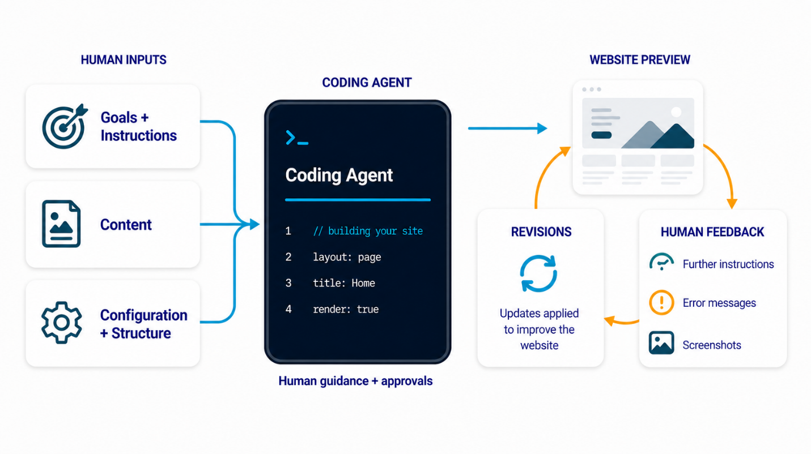
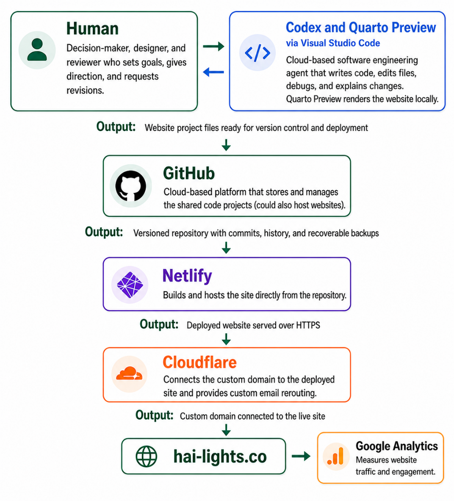

In my [introductory post](https://hai-lights.co/posts/2026_04_20_welcome/), I briefly hinted at the fact that I built this website with artificial intelligence (AI) tools. In this post, I wanted to get a bit more technical and write about the **workflow** I used to create it. Of course, it is not the only way, and perhaps there are more autonomous ways to build websites, but it got me the **verifiable result** that I wanted -- a working website that was designed with my guidance and to my specifications.

This guide is not comprehensive but meant to give you an idea of what is possible using these powerful tools. If you know nothing about website building, Python, Codex, or other tools, you can simply start chatting with an AI chatbot by stating your objective. State your goals and ask the chatbot to guide you step by step as a beginner. It would walk you through the installation process, help you locate the needed tools, ask for permissions to do some tasks, and debug errors. When it is not clear what the coding agent is doing or why, ask clarifying questions and inquire about the reasoning behind the tasks. Regarding the creative process, you can be very involved by making every design decision about your product -- where to display the logo, what sizes and colors work best and so on -- or as little as you want. In this case, you can ask a coding agent to use the best practices to build you a working website.

I ended up using a lot of tools and services, but most of the time I spent working with Codex -- my main 'partner' in this project, a coding agent developed by OpenAI -- through the Visual Studio Code environment. Using natural language, I specified my goals and provided all content such as my bio, summaries, creative materials, logos, links, images, and a Quarto website template (Figure 1). Once Codex wrote the code, I rendered the website locally on my laptop through Quarto Preview, tested it, and then asked for changes and corrections using natural language. This is where I spent most of my time -- iterating the look and experience of the website. When pages did not load, I would copy/paste error messages and let Codex debug it. In some cases, it was useful to provide a screenshot of the environment for the coding agent to "see" what is wrong with the website. If the design did not look right, I would provide further feedback, instructions, and sometimes sketches. I found it fascinating how much code was created in such a short time. There were a lot of things that happened under the hood, but as the main decision-maker and designer I had the final say on all outputs of my website.

{fig-alt="The diagram illustrates a collaborative workflow between a human inputting content and a coding agent for website development, featuring steps like content creation, layout adjustments, and error handling." fig-align="center" width="90%"}

There were some frustrating moments around graphics generation, logo placement, and other design renderings. The coding agent does not always fix the problem on the first couple of runs, even with submitted sketches and screenshots. Sometimes I had to come up with a different way to explain what I wanted and other times I had to use multiple tools or chatbots. I could also see that a trained software developer would guide the coding agent much more effectively and meaningfully by looking at the actual code if needed, but these AI agents do get better very quickly.

During the development stage, I hosted my files on GitHub, a cloud-based platform, to store my backup for the website files. After multiple iterations, I got the desired result. After the website worked and looked good on my laptop, it was important to check what it looked like on cell phones, tablets or similar devices. This can also be done locally through Quarto Preview by opening the browser's Developer Tools and switching to device simulation mode, where you can select specific screen sizes such as iPhone 17. I had to specifically adjust certain behaviors and elements of my website (e.g. headline wrapping, button and option display, and sequential or side-by-side arrangement of text and images) with different screen sizes in mind.

Once my website was ready for deployment, I used the workflow shown in Figure 2. I committed all final files to GitHub (which can also host websites) and then used Netlify to build the website from my Quarto source files and host the generated static output. I purchased a custom address (hai-lights.co) on Cloudflare that handles the security certificates and forwards my emails from a custom email to a preferred one. As a final step, I connected Google Analytics to track visitor traffic and page usage over time.

{fig-alt="The image illustrates a workflow for web development and deployment, starting with a human decision-maker, progressing through coding, previewing, version control, hosting, and analytics, all integrated with tools like Visual Studio Code, GitHub, Netlify, Cloudflare, and Google Analytics." fig-align="center" width="70%"}

Building and launching this website was a rather 'manual' process from the AI tools perspective. In the (near) future, I can imagine that it will be prepackaged for you to simply upload your CV and other relevant materials, and perhaps answer some questions, but the building, designing, and deploying will be done automatically on your behalf.
