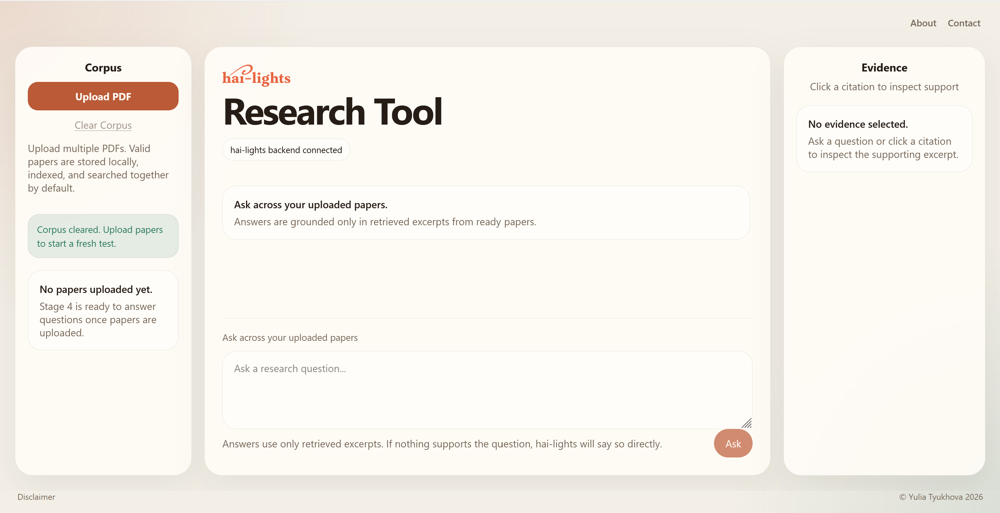
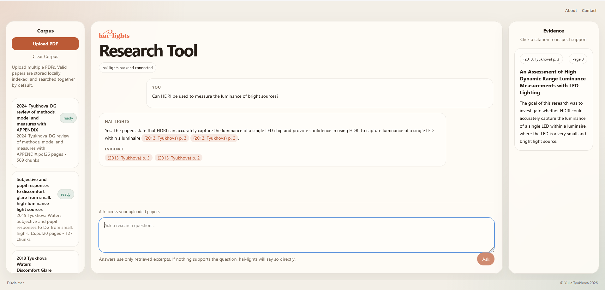

Note: This post is the first in the series.

A couple of years ago, when I was writing a [research literature review on discomfort glare models](https://doi.org/10.1016/j.buildenv.2024.111850)<sup>1</sup> with 164 references (and 9 more in the appendix), it would have been very convenient to be able to query my digital library instead of trying to remember where I had read a particular insight. Now, with AI improving seemingly daily, it is becoming a reality. Uploading PDFs directly to a large language model (LLM) is constrained by copyright issues and a limited context window (how much the model "remembers" at one time). But also, crucially, AI systems hallucinate - they generate made-up responses and incorrect information, including fabricated references<sup>2</sup>. In addition, LLMs have static knowledge, as they are trained on data available only up to a certain cutoff date. While this limitation can be partially mitigated through web search, LLMs may still lack domain-specific knowledge.

To address this, I decided to build a tool that can provide reliable and relevant answers based on research papers that I have in my digital library (Figure 1). The goal of the Hai-lights research tool is to enable users to ask questions about research topics covered in the uploaded papers and get relevant and accurate information for further inspection and research.

```{=html}
<div class="quarto-figure quarto-figure-center">
  <figure class="figure">
    <p>
      <a href="media/image1.png" target="_blank" rel="noopener noreferrer">
        
      </a>
    </p>
    <figcaption>Figure 1. An early-stage research tool based on the RAG system that allows the user to ask questions about the uploaded research papers.</figcaption>
  </figure>
</div>
```

One way to accomplish this is to use a **Retrieval-Augmented Generation (RAG)** pipeline. It enables LLMs to provide more accurate results by referencing trusted sources, such as the research papers in my digital library, before generating responses. The idea is that RAG first retrieves relevant information from the uploaded PDFs based on a user's question and then feeds that information into the LLM to generate a response. This reduces (although does not necessarily eliminate) hallucinations, uses documents that I already own, and utilizes capabilities of available pre-trained models. RAG combines retrieval (finding relevant information) and generation (producing natural language responses) to improve accuracy in AI systems.

The main idea behind the RAG system<sup>3, 4</sup> used in this local app is as follows:

1. After I upload the research papers into my local app, the **ingestion** stage uses chunking and indexing to make the corpus searchable.

2. The **pre-retrieval** stage transforms the question into a more effective search query (e.g. normalizes the text, determines its type, etc.).

3. The **retrieval** stage finds possible evidence using semantic and lexical retrieval.

4. The **post-retrieval** stage determines which evidence is most relevant and usable by reranking and filtering the candidate chunks.

5. The **generation** stage uses the LLM to compose a clear, readable answer from the selected evidence.

6. The **evidence-building** stage provides citations and page numbers from research papers for further **verification**.

Similar to when [I built my website](https://hai-lights.co/posts/2026_05_07_building_a_website_through_conversations/), I used Codex via the Visual Studio (VS) Code environment for building this tool. My first goal was to build a working prototype, which I accomplished in a single afternoon. However, the agent generated so much code that the overall structure quickly became difficult to follow, even when I asked questions. I started over, and this time I wrote a design document in plain English to guide the AI agent and track what had already been accomplished. It lists the project goals and the required features in as much detail as possible, serving as a reference for both the developer (me) and the agent.

The initial prompt I used to create this research tool with Codex via VS Code was:

> "Hai-lights is a local research-paper assistant that lets a user chat with a corpus of PDF papers and receive evidence-grounded answers with clear citations. The app is designed to prioritize accuracy, reliability, transparency, speed, low cost, and simple, sleek website design."

The system should ingest research papers in PDF format uploaded by the user, index them for semantic retrieval, answer questions only from retrieved excerpts, show clear evidence and citations, and, importantly, say "I don't know based on the uploaded papers." when evidence is insufficient.

Under my overall guidance, Codex built a working early-stage research tool that lets me ask questions about the uploaded PDFs. In addition to using RAG, I added a critical **verification** step: displaying the original excerpt(s) alongside citations so that any answer can be checked directly against the source. This evidence panel is a core component of the interface, which consists of three main areas (Figure 2) - the corpus of uploaded and processed PDFs, the chat window that lets the user ask questions about the corpus, and the evidence panel, which can be inspected to **verify** the generated answers.

```{=html}
<div class="quarto-figure quarto-figure-center">
  <figure class="figure">
    <p>
      <a href="media/image2.png" target="_blank" rel="noopener noreferrer">
        
      </a>
    </p>
    <figcaption>Figure 2. An early-stage research tool based on the RAG system. Asking a simple question on a corpus of 4 papers.</figcaption>
  </figure>
</div>
```

At first, testing was manual - I would load the tool locally and ask a couple of questions about papers I knew well. Some answers were good, while others were not. My feedback enabled Codex to update the code and improve the quality of the answers. To build a reliable tool, I needed a systematic way to test the system across a wide range of potential questions. To avoid depending on a single model, I asked Claude to help make the assessment more automated. Together, we created an evaluation set for one paper. Claude (Sonnet 4.6) generated most of the question-answer pairs, but I verified each one and contributed several myself. Each entry in the evaluation set contains multiple fields, including the question, the expected answer, the source passage(s) where the answer can be found, the page number(s), the question's difficulty, and its type. The resulting evaluation set for one research paper included 49 questions spanning look-up, implicit, paraphrased, numerical, synthesis, and out-of-scope types.

After several rounds of testing and improvement, I inspected my system more closely and noticed that the wording of some answers matched entries in the evaluation set word for word. The system had hard-coded the answers and overfit to the evaluation set in order to achieve a high score on this particular paper and question set. In subsequent prompts, I specifically asked for best practices in RAG system design and software engineering (I wanted well-written code rather than incremental patches). After a few more rounds of refinement, the performance scores did not improve. Feedback from Claude and Codex pointed to several notable directions: maintain a held-out test set (a set of questions that are reserved only for the final evaluation, separate from those used for development); and build an evaluation set that covers multiple papers instead of one, so that the architecture does not have to be rebuilt in the future. In addition, the overview research papers on RAG<sup>3, 4</sup> discussed off-the-shelf open-source components that I want to consider in the next stage to simplify the development.

There are definitely more questions than answers at this early stage, but it gave me a good first introduction to RAG systems. Below are a couple of things I learned during this early exploration stage.

## What I learned

- Use a detailed design document to guide development;
- Build an evaluation set with various types of questions; use most questions during development, while reserving a held-out set for final assessment only;
- Create an evaluation set that covers multiple papers instead of one, to avoid rebuilding the architecture of the tool later;
- Consider using off-the-shelf open-source components to simplify the development of the tool; find the right balance between a custom RAG pipeline and available components.

Stay tuned for the next development stage.

Submit any comments or questions to **[yulia@hai-lights.co](mailto:yulia@hai-lights.co)**.

## References

1. Yulia Tyukhova. 2024. *Discomfort glare in outdoor nighttime environments after dark - A review of methods, measures, and models.* *Building and Environment* 263, 111850. [https://doi.org/10.1016/j.buildenv.2024.111850](https://doi.org/10.1016/j.buildenv.2024.111850)
2. He Liu. 2026. *Fabricated citations in the age of AI: A wake-up call for editors, reviewers, and authors.* *J Dent Sci.* 21(1):679-680. [https://doi.org/10.1016/j.jds.2025.10.024](https://doi.org/10.1016/j.jds.2025.10.024)
3. Yizheng Huang and Jimmy Xiangji Huang. 2026. *A Survey on Retrieval-Augmented Text Generation for Large Language Models.* *ACM Computing Surveys* 58(12), Article 300. [https://doi.org/10.1145/3805774](https://doi.org/10.1145/3805774)
4. Yunfan Gao, Yun Xiong, Xinyu Gao, Kangxiang Jia, Jinliu Pan, Yuxi Bi, Yi Dai, Jiawei Sun, Meng Wang, and Haofen Wang. 2023. *Retrieval-augmented generation for large language models: A survey.* arXiv:2312.10997. [https://arxiv.org/abs/2312.10997](https://arxiv.org/abs/2312.10997)
